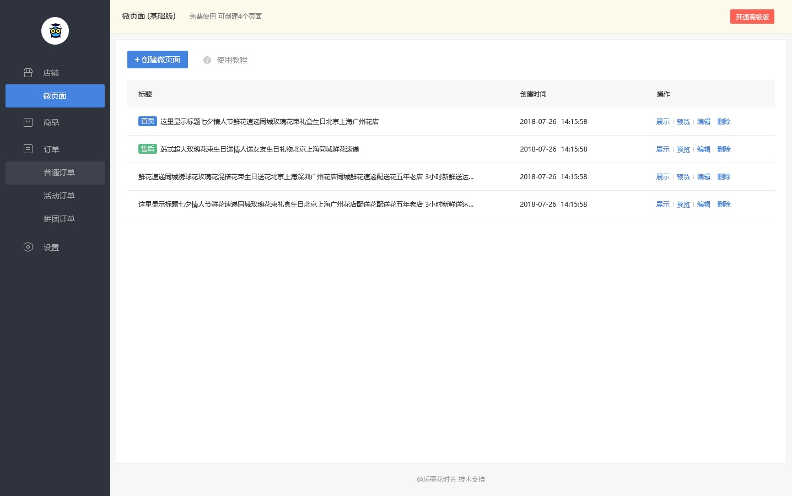

# 微页面主页
## 功能说明
微页面是可以自定义编辑的页面，商家既可以把它当做普通的页面来使用，也可将任一微页面设为店铺主页或将页面设置为售后内容。
页面中的各个模块可以自由组合，方便商家创建个性化的小程序页面。
## 产品功能
### 微页面管理页面

#### 左侧导航栏

最上方为店铺的头像
下方的一级菜单依次为店铺、商品（本次开发不做）、订单、设置，
店铺中包含二级菜单：微页面、店铺主页
订单中包含二级菜单：普通订单、活动订单、拼团订单

点击一级菜单，直接进入第一个二级页面，如点击店铺，进入微页面模块

当前打开的菜单对应的页面，按钮显示为蓝色，如上图的微页面
鼠标移动到的菜单，按钮显示为灰色，如上图的普通订单

#### 页面标题栏

显示当前页面的标题
微页面主页中，当前版本显示：微页面（基础版）可创建20个页面
> 当前版本不做的内容“免费使用” 开通高级版

#### 创建微页面按钮
若创建的页面不足20个，点击此按钮跳转，微页面创建页面，可以创建新的页面
若创建的页面已有20个，点击此按钮，弹出提示：“您已创建了20个微页面，无法继续创建”
（删除一个页面后，再点击，可以跳转）

#### 使用教程
点击使用教程，跳转微页面功能的使用教程页面，介绍微页面的使用方法

#### 页面列表
列表中显示已创建的微页面（标题、创建时间、操作按钮）
点击标题进入微页面的编辑页面；创建时间为用户创建该微页面的时间
其中已被设置为主页的页面，标题前显示“主页”标签
>（当前版本不做）其中已被设置为售后内容的页面，标题前显示“售后”标签

#### 操作按钮
设为主页（当前主页）、预览、编辑、删除

设为主页（当前主页）按钮：
页面未被设为主页时，按钮显示为设为主页，点击可以将对应的页面设为主页；
页面已被设为主页时，按钮显示为当前主页，按钮颜色显示为灰色，不可点击

预览按钮：
点击预览，弹出对应微页面的小程序码，扫小程序码可以打开对应的小程序页面，如下图左侧码所示，开发时主页高度不变，居中显示

编辑按钮
点击可以进入微页面的编辑页面

删除按钮
点击弹出弹窗“是否确认删除该页面，删除后不可恢复”（按钮：取消、确认）点击取消，不删除页面；点击确认，删除该页面

[ 返回PC版功能清单](mweblib://15365566054481)