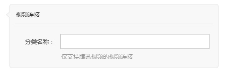
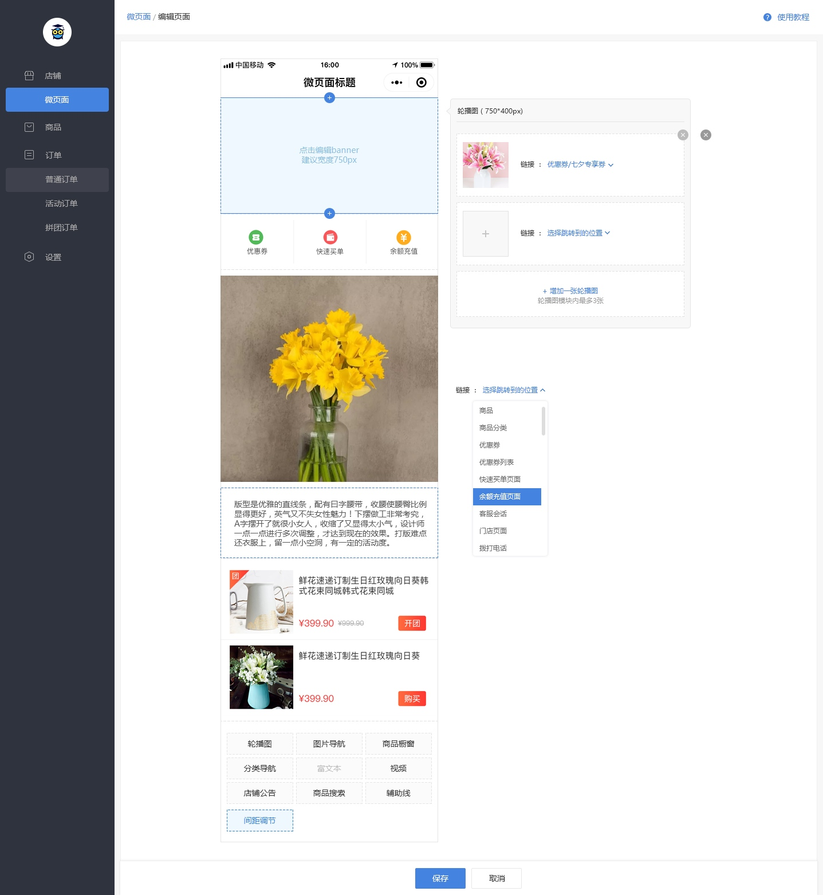
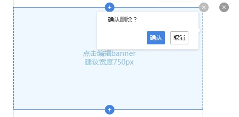

# 创建微页面
### 进入页面
商家可以在微页面编辑页面中自由组合页面的内容，商家可以增加、删除相应的模块；
左侧为页面的预览区域（小程序对应页面中的布局与之一致），点击对应区域右侧出现气泡状的编辑框

进入该页面，默认选中页面的标题区域，右侧显示标题编辑区域（包含标题输入框及提示文字，如下图）

> 图中的“视频连接”位置显示为“页面标题”，“分类名称”位置显示为“页面标题”，“仅支持腾讯视频的视频连接”位置显示为“您还可以输入20个字符”

标题输入框，可以输入汉字、英文、数字，最多输入20个字符；不在范围内的字符（超出20个字符、标点、表情等）前端直接过滤

提示文字，标题不满20个字符时显示为“您还可以输入XX个字符”;满20个字符时显示为红色字的“您已输入20个字符”

### 增加模块
点击页面下方的按钮，可以增加对应的模块；

可以增加的模块有：轮播图、图片导航、商品橱窗、分类导航、富文本、视频、店铺公告、商品搜索、辅助线、间距调节

可增加的模块显示样式为黑色；
鼠标移动到可增加的模块显示样式，如上图的“间距调节”；
已到达增加数量上限的颜色为灰色，如上图的“富文本”

每个模块可增加的数量，见模块说明需求

### 修改/删除

点击对应的模块可以选中该模块并在右侧显示的气泡编辑框中编辑该模块的内容，选中时该模块周围会显示蓝色的边框，如下图
注意！选中标题时不显示蓝色的边框

并在右上角显示删除的按钮，删除按钮默认为浅灰色，鼠标滑过显示颜色为深灰色
点击按钮弹出删除询问窗口，确认后可以删除对应模块；取消则不做更改

点击上方和下方的加号，在右侧显示气泡编辑区域中显示增加模块的按钮，点击可以增加模块
若点击的上方的加号，则增加的模块在该模块的上方；点击下方的，则在下方

按住模块可以进行上下拖动，以调整顺序

### 保存
保存时，检查是否所有内容已填
全部已填，则直接保存，并返回微页面主页

有内容未填，则弹窗询问“还有内容未填写，继续保存？”   蓝色按钮“返回修改”  白色按钮“继续保存”
点击返回修改，则按照排序选中第一个没有完成编辑的模块；
点击继续保存，则暂存并返回微页面主页；

暂存的页面在微页面列表中，预览按钮为灰色，点击弹出提示窗口，  “该页面还有内容未填写，无法预览” 蓝色按钮“去编辑”  白色按钮“取消”；去编辑跳转该页面的编辑页面

### 对应模块详细说明

|[图片导航](mweblib://15365486731729)|[轮播图](mweblib://15365485647284)|[富文本](mweblib://15365591582509)|
| --- | --- | --- |
|[商品橱窗](mweblib://15365621883313)|[分类导航](mweblib://15365642240382)|[视频](mweblib://15365670374427)|
|[店铺公告](mweblib://15365670292314)|[商品搜索](mweblib://15365670257839)|[辅助线](mweblib://15365670210813)|
|[间距调节](mweblib://15365668696176)|||

[ 返回PC版功能清单](mweblib://15365566054481)