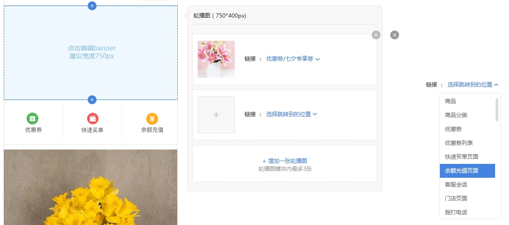
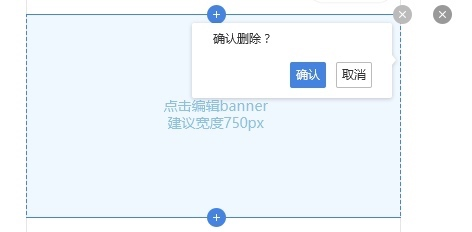

# 轮播图
每个页面可以添加10张轮播图

#### 图片大小
图片以aspectFit的形式展示，框架的尺寸使用图片高度除以宽度的值最大的图片的宽高比，宽度为整个屏幕的尺寸
若几张图片中有图片比例不一致，同样宽度下图片高度较小的在模块内居中显示

#### 增加/删除/修改
在轮播图模块内，可以添加三张图片；添加3张轮播图后，增加轮播图的按钮隐藏；已添加3张轮播图的，删除一张轮播图，增加轮播图的按钮重新出现

每个图片编辑框右上角有删除按钮，删除按钮默认为浅灰色，鼠标滑过时变为深灰色，
点击按钮弹出删除询问窗口，确认后可以删除对应模块

点击图片上传按钮/已上传的图片，可以上传/修改图片

#### 跳转设置

轮播图可以连接对应的页面，点击选择跳转到的位置，可以弹出跳转选择框，
可选项：商品、商品分类、微页面、优惠券、优惠券列表、快速买单页面、余额充值页面、客服会话、门店页面、拨打电话

商品、商品分类、微页面、优惠券，选择后详见[页面跳转选择](mweblib://15366517292480)

选择拨打电话后，选择框下方增加一个输入框，仅可输入一个手机号或者固定电话号码

[ 返回PC版功能清单](mweblib://15365566054481)
[ 返回微页面主页](mweblib://15364825519106)