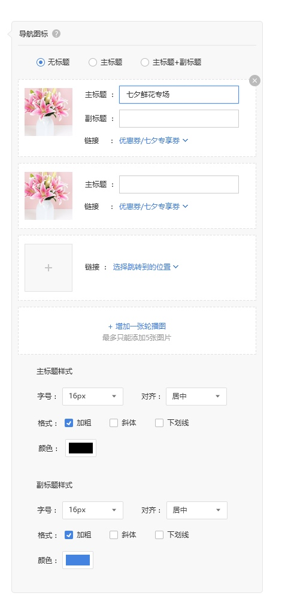
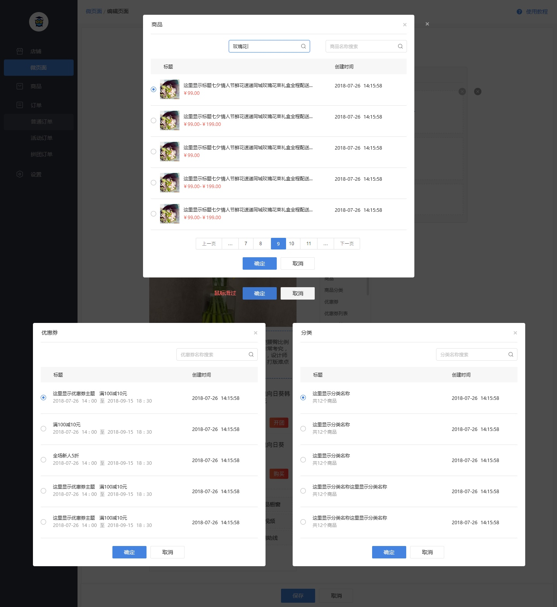

# 图片导航
> 每个页面可以添加5个图片导航

图片: https://images-cdn.shimo.im/eY9WbMTITncOJjvB/image.png

#### 增加/删除/修改
图片导航模块最多添加5张图片，增加5个后隐藏增加按钮，已有5个的删除一个后，增加按钮重新出现

删除按钮默认为浅灰色，鼠标滑过时变为深灰色，
点击按钮弹出删除询问窗口，确认后可以删除对应模块

点击图片上传按钮/已上传的图片，可以上传/修改图片

#### 图片大小
图片的宽度=页面宽度/图片张数，高度=图片的宽度/宽度的值最大的图片的宽高比
若几张图片中有图片比例不一致，同样宽度下图片高度较小的在模块内居中显示

#### 标题
图片导航的标题，
根据上方选择的标题样式（无标题、主标题、主标题+副标题）显示

此处的标题可以输入汉字、英文、数字，最多输入20个字符

字号：选择范围10px、12px、14px、16px、18px、20px、22px、24px

其他可选的样式：加粗、倾斜、下划线、删除线、字体颜色、背景颜色

##### 字体颜色/背景色
字体颜色、背景颜色可选的颜色共70种，其中10种为标准颜色，60种为常用颜色，色值如下表

标准颜色

|#c00000|#ff0000|#ffc000|#ffff00|#92d050|#00b050|#00b0f0|#0070c0|#002060|#7030a0|
| :-- | :-- | :-- | :-- | :-- | :-- | :-- | :-- | :-- | :-- |

常用颜色

|#ffffff	|#000000|#eeece1|#1f497d|#4f81bd|#c0504d|#9bbb59|#8064a2| #4bacc6|#f79646|
| --- | --- | --- | --- | --- | --- | --- | --- | --- | --- |
|#f2f2f2|#7f7f7f|#ddd9c3|#c6d9f0|#dbe5f1|#f2dcdb|#ebf1dd|#e5e0ec|#dbeef3|#fdeada
|#d8d8d8|#595959|#c4bd97|#8db3e2|#b8cce4|#e5b9b7|#d7e3bc|#ccc1d9|#b7dde8|#fbd5b5|
|#bfbfbf	|#3f3f3f	|#938953	|#548dd4|#95b3d7|#d99694|#c3d69b|#b2a2c7|#92cddc|#fac08f|
|#a5a5a5	|#262626	|#494429	|#17365d|#366092|#953734|#76923c|#5f497a|#31859b|#e36c09|
|#7f7f7f	|#0c0c0c	|#1d1b10	|#0f243e|#244061|#632423|#4f6128|#3f3151|#205867|#974806|

若设置标题背景色，则背景色的宽度为图片宽度-2rPX（两边各显示1rpx的边距），未显示标题背景色的部分用页面背景色显示

#### 跳转设置
可以连接对应的页面，点击选择跳转到的位置，可以弹出跳转选择框，
可选项：商品、商品分类、微页面、优惠券、优惠券列表、快速买单页面、余额充值页面、客服会话、门店页面、拨打电话

商品、商品分类、微页面、优惠券，点击后会弹出选择弹窗页面如下图所示

选择拨打电话后，后方跟随一个输入框，仅可输入一个手机号或者固定电话号码

[ 返回PC版功能清单](mweblib://15365566054481)
[ 返回微页面主页](mweblib://15364825519106)