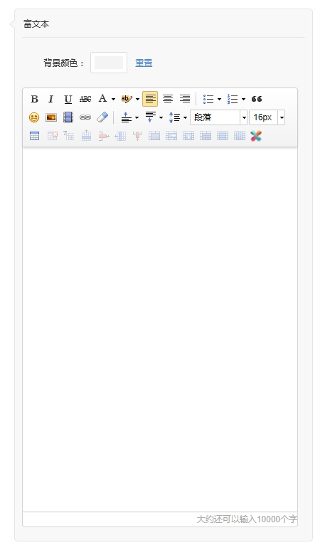

# 富文本
> 一个页面只能增加1个分类导航模块

商家可以通过富文本功能来进行一些基础的图文排版，可以修改的内容包括富文本模块的背景色、模块内每个字的排版方式、图片

新创建无内容时显示示例内容，有内容时显示用户输入的内容

> 每个页面可以添加一个富文本

#### 编辑器调整
仅保留：加粗、斜体、下划线、删除线、字体颜色、背景颜色、靠左、居中、靠右、上传图片、字体大小

##### 文字
字号大小仅可选择：10px、12px、14px、16px、18px、20px、22px、24px、36px、48px
最多输入20000个字符的文字，可以输入：文字、字母、数字、标点符号，其他内容前端直接过滤掉

#### 图片
上传的图片必须在2M以内
最多可以上传20张图片

#### 限制及提醒
编辑器下方的的提示文字“大约还可以输入10000个字、上传20张图片”

当输入文字超过限制时，输入的内容直接过滤，提示文字：“您已输入10000个字（红色字），还可以上传XX张图片（灰色字）”

当输上传图片达到20张时，隐藏图片上传按钮，提示文字：“大约还可以输入xxxx个字（灰色字）、您已上传20张图片（红色字）”

[ 返回PC版功能清单](mweblib://15365566054481)
[ 返回微页面主页](mweblib://15364825519106)