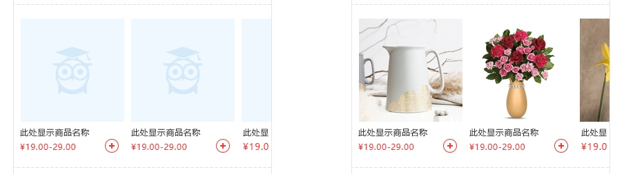
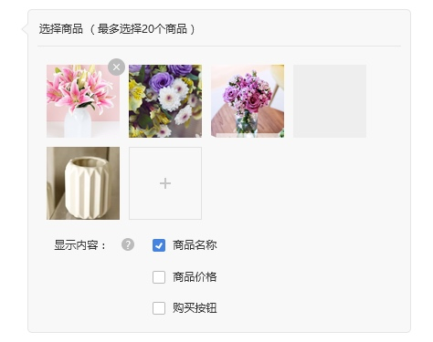
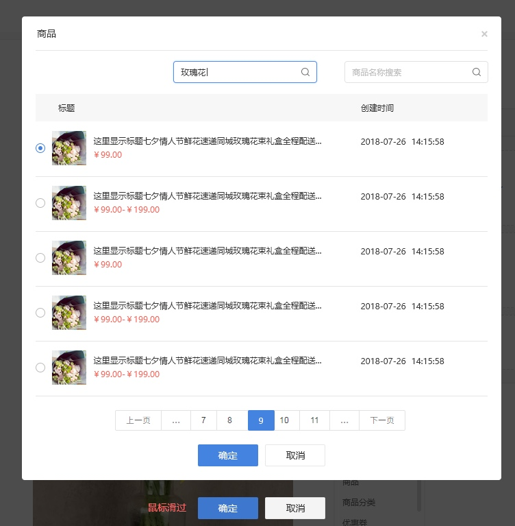

# 商品橱窗
> 每个页面只能增加1个商品橱窗

> 上图中“选择商品（最多选择20个商品）”应为“商品橱窗（最多可以选择20个商品）

#### 显示方式
左右滑动可以查看其它商品，商品名称、商品价格、购买按钮，根据设置中的选择显示

#### 橱窗商品编辑
点击选择商品按钮，弹出商品选择页面如下图
选择20个商品后隐藏商品选择按钮，删除一个后选择商品按钮重新出现

商品图片右上角有删除按钮
删除按钮默认为浅灰色，鼠标滑过显示为深灰色
点击按钮弹出删除询问窗口，确认后可以删除对应模块

[ 返回PC版功能清单](mweblib://15365566054481)
[ 返回微页面主页](mweblib://15364825519106)