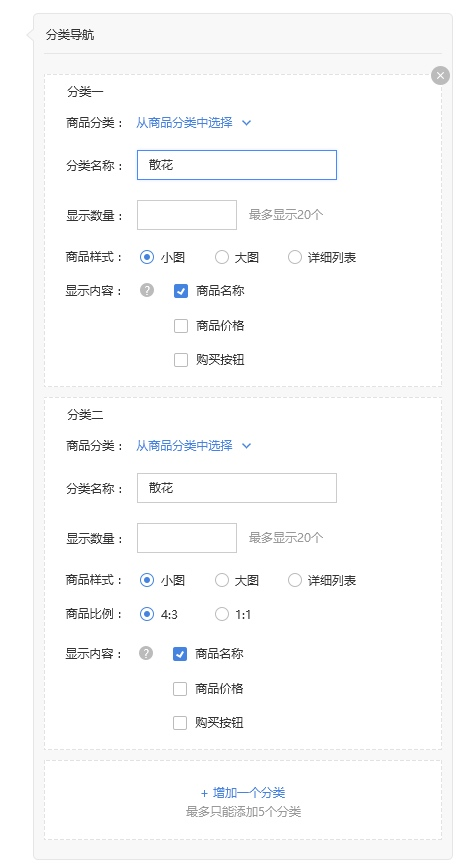
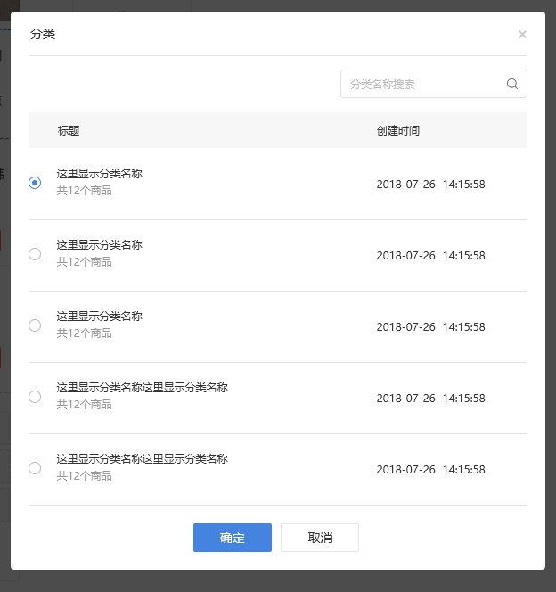
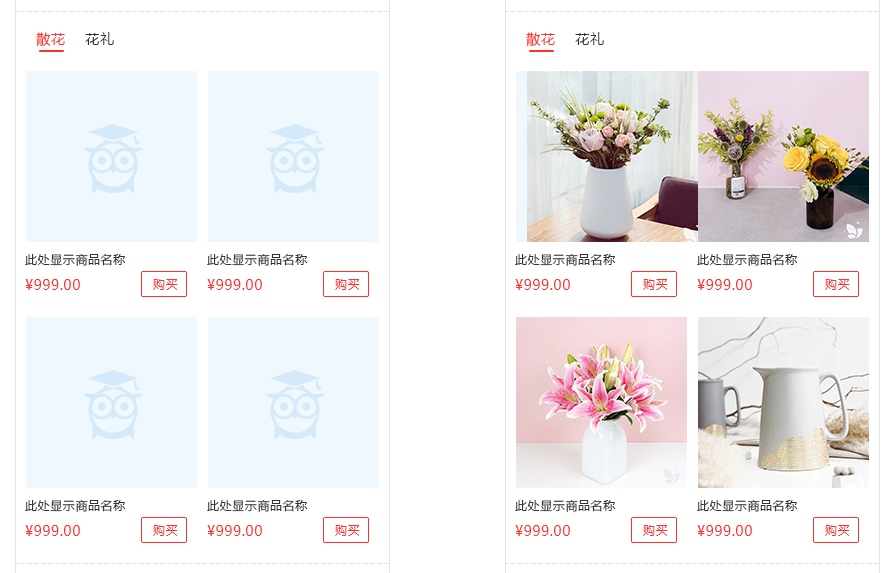
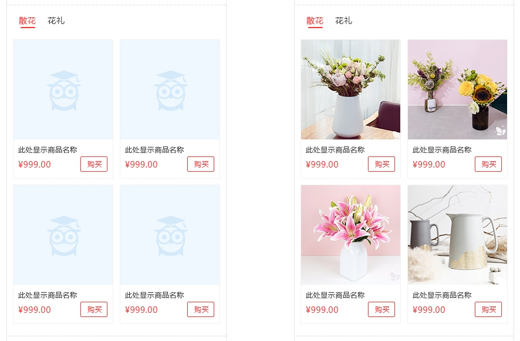
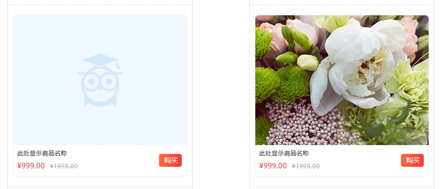
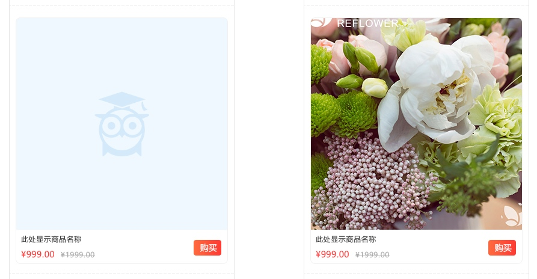
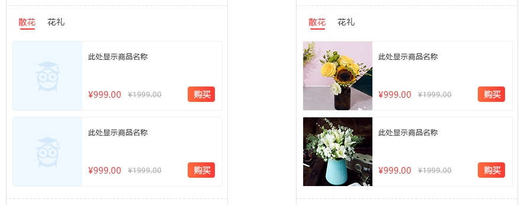
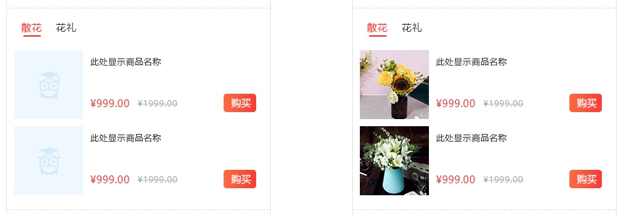

# 分类导航
> 每个页面只能增加1个分类导航

> 分类导航模块最多可以关联5个分类
点击增加一个分类按钮，增加一个分类编辑框
添加5个分类后，隐藏添加按钮，删除一个分类后该按钮重新出现

每个分类右上角有删除按钮
删除按钮默认为浅灰色，鼠标滑过显示为深灰色
点击按钮弹出删除询问窗口，确认后可以删除对应模块

#### 分类选择
点击从商品分类选择，弹出商品选择框，如下图

#### 分类名称
默认显示为原先的分类名称，可以进行修改；
分类名称最多10个字符，可以输入汉字、字母、数字，超出范围前端直接过滤

#### 商品数量
默认值：分类中的商品数，超过20则为20
用户可以修改，输入范围为1-20的正整数

#### 商品样式
可选项：小图、大图、详细列表

选择大图时，下方出现选项“图片比例：4：3、1：1”
选择小图、详细列表时，下方出现选项“商品边框：显示、不显示”
详见下方的图片

商品样式：小图
商品边框：不显示

商品样式：小图
商品边框：显示

商品样式：大图
图片比例：4：3

商品样式：大图
图片比例：1：1

商品样式：详细列表
商品边框：显示

商品样式：详细列表
商品边框：不显示

[ 返回PC版功能清单](mweblib://15365566054481)
[ 返回微页面主页](mweblib://15364825519106)