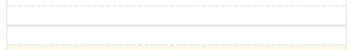
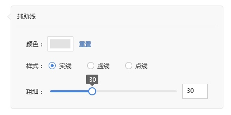

# 辅助线
> 一个页面中最多添加20个辅助线

可以设置辅助线的线型、线条的粗细、线条的颜色

线型可选3种：直线（——————————）、点线（········）、虚线（---------）三种
线条粗细：1rpx-10rpx（10个整数值）

线条的颜色，可选的值如下表

标准颜色

|#c00000|#ff0000|#ffc000|#ffff00|#92d050|#00b050|#00b0f0|#0070c0|#002060|#7030a0|
| :-- | :-- | :-- | :-- | :-- | :-- | :-- | :-- | :-- | :-- |

常用颜色

|#ffffff	|#000000|#eeece1|#1f497d|#4f81bd|#c0504d|#9bbb59|#8064a2| #4bacc6|#f79646|
| --- | --- | --- | --- | --- | --- | --- | --- | --- | --- |
|#f2f2f2|#7f7f7f|#ddd9c3|#c6d9f0|#dbe5f1|#f2dcdb|#ebf1dd|#e5e0ec|#dbeef3|#fdeada
|#d8d8d8|#595959|#c4bd97|#8db3e2|#b8cce4|#e5b9b7|#d7e3bc|#ccc1d9|#b7dde8|#fbd5b5|
|#bfbfbf	|#3f3f3f	|#938953	|#548dd4|#95b3d7|#d99694|#c3d69b|#b2a2c7|#92cddc|#fac08f|
|#a5a5a5	|#262626	|#494429	|#17365d|#366092|#953734|#76923c|#5f497a|#31859b|#e36c09|
|#7f7f7f	|#0c0c0c	|#1d1b10	|#0f243e|#244061|#632423|#4f6128|#3f3151|#205867|#974806|

[ 返回PC版功能清单](mweblib://15365566054481)
[ 返回微页面主页](mweblib://15364825519106)