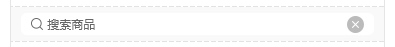
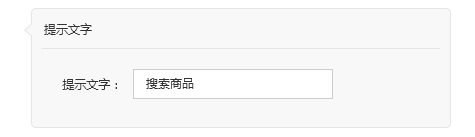

# 商品搜索
> 每个页面只能添加1个商品搜索模块

提示文字默认值：搜索商品
编辑的提示文字显示在搜索框内
可以输入：汉字，字母，数字，标点符号，空格 最多可以输入32个字符

下方使用视频模块的输入框下面的提示文字的样式内容“大约还可以输入32个字符”
输入32个字符后，内容显示为红色的“已输入32个字符”且前端直接过滤多出的内容

[ 返回PC版功能清单](mweblib://15365566054481)
[ 返回微页面主页](mweblib://15364825519106)
