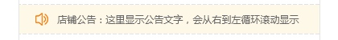
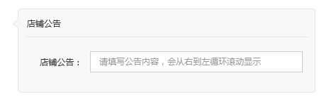

# 店铺公告
> 每个页面只能添加1个店铺公告

默认显示内容为“这里显示公告文字，会循环滚动显示”
修改后显示用户输入的内容

可以输入：汉字，字母，数字，标点符号，空格 最多可以输入100个字符
下方使用视频模块的输入框下面的提示文字的样式内容“大约还可以输入100个字符”
输入100个字符后，内容显示为红色的“已输入100个字符”且前端直接过滤多出的内容

[ 返回PC版功能清单](mweblib://15365566054481)
[ 返回微页面主页](mweblib://15364825519106)
