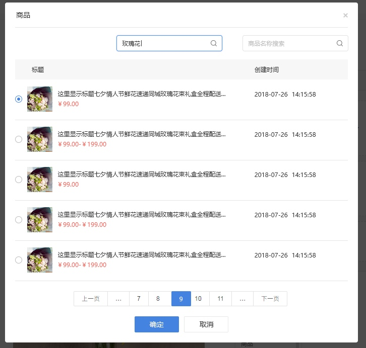
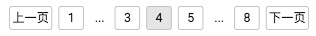
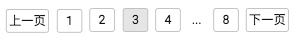
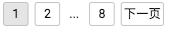
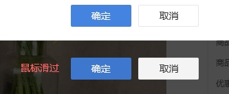
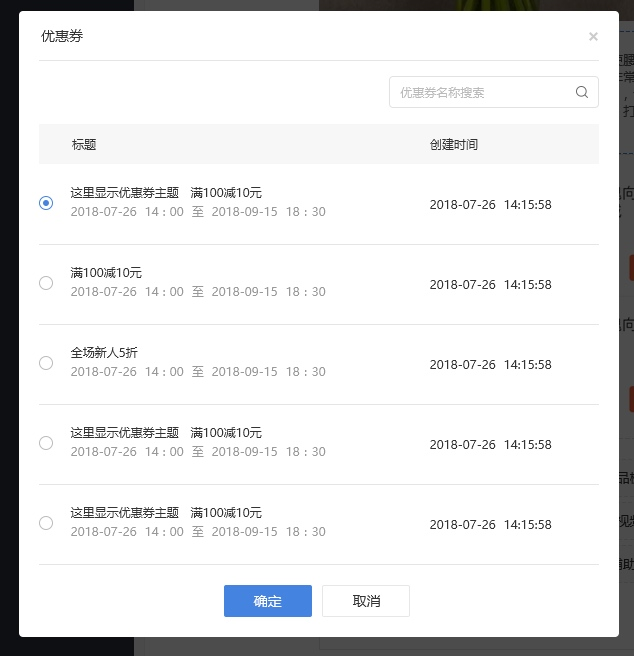
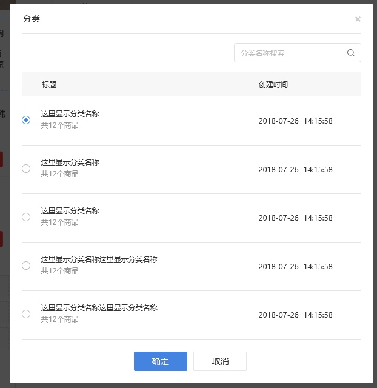

# 页面跳转选择

## 跳转商品
当页面中某处选择跳转商品时，弹出商品跳转选择页面，如下图所示，在页面中垂直&水平居中显示

#### 商品列表
商品列表中显示选择框、商品的首图、标题、价格（或价格区间）、商品创建时间

选择款为单选，若之前已选过商品，重新进入之前选择的商品上应勾选上
商品首图，显示商品的第一张主图
商品名称，显示商品的名称，超过显示范围用...代替
价格（或价格区间），显示商品的价格或价格区间，若商品有设置特价活动，则显示为商品的活动价；否则显示商品的原价
商品创建时间，显示商品的创建时间

#### 搜索框

默认显示样式

有内容时的样式

有内容并点击🔍或按键盘上的回车键，则在下方商品列表中显示商品名称包含该关键词的商品；无内容并点击🔍或按键盘上的回车键，则在下方显示所有商品

#### 翻页
翻页按钮，按照设计图中的样式并按照下方的图示进行；只有一页时不显示

#### 确认&取消按钮

上方的按钮为按钮默认的样式，下方的按钮为鼠标滑过时按钮的显示样式

-------

## 跳转优惠券
当页面中某处选择跳转优惠券时，弹出优惠券跳转选择页面，如下图所示，在页面中垂直&水平居中显示

#### 优惠券的列表

优惠券列表中显示选择框、优惠券的主题名称、优惠券的内容、有效期、创建时间

优惠券的主题名称、优惠券的内容，显示在同一行

#### 搜索框

默认显示样式

有内容时的样式

有内容并点击🔍或按键盘上的回车键，则在下方优惠券列表中显示活动主题包含该关键词的优惠券；无内容并点击🔍或按键盘上的回车键，则在下方显示所有优惠券

#### 翻页
翻页按钮，按照设计图中的样式并按照下方的图示进行；只有一页时不显示

#### 确认&取消按钮

上方的按钮为按钮默认的样式，下方的按钮为鼠标滑过时按钮的显示样式

-------

## 跳转商品分类
当页面中某处选择跳转商品分类时，弹出商品分类跳转选择页面，如下图所示，在页面中垂直&水平居中显示

#### 商品分类的列表

商品分类列表中显示选择框、分类名称、分类下的商品数、创建时间

#### 搜索框

默认显示样式

有内容时的样式

有内容并点击🔍或按键盘上的回车键，则在下方商品分类列表中显示分类名称包含该关键词的商品分类；无内容并点击🔍或按键盘上的回车键，则在下方显示所有商品分类

#### 翻页
翻页按钮，按照设计图中的样式并按照下方的图示进行；只有一页时不显示

#### 确认&取消按钮

上方的按钮为按钮默认的样式，下方的按钮为鼠标滑过时按钮的显示样式

## 跳转微页面
当页面中某处选择跳转微页面时，弹出微页面跳转选择页面，如下图所示，在页面中垂直&水平居中显示
可参考商品分类的页面样式，但是页面标题与创建时间对其

#### 微页面的列表

微页面列表中显示选择框、页面名称、创建时间

#### 搜索框

默认显示样式

有内容时的样式

有内容并点击🔍或按键盘上的回车键，则在下方微页面列表中显示页面名称包含该关键词的页面；无内容并点击🔍或按键盘上的回车键，则在下方显示所有微页面

#### 翻页
翻页按钮，按照设计图中的样式并按照下方的图示进行；只有一页时不显示

#### 确认&取消按钮

上方的按钮为按钮默认的样式，下方的按钮为鼠标滑过时按钮的显示样式